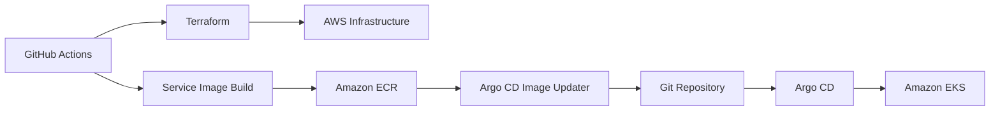
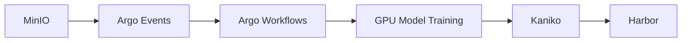
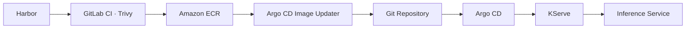

<h1 align="center">Hybrid Cloud Event-Driven AI Serving Platform</h1>

  
  
  

## 프로젝트 개요

Hybrid AI Serving Platform은 Private Cloud에서 AI 모델을 학습 · 패키징하고, 모델 이미지를 검사한 뒤 Public Cloud의 AWS ECR/EKS/KServe 환경에 배포하여 실시간 AI 추론 서비스를 제공하는 Hybrid Cloud 기반 AI Serving Platform입니다.

### 핵심 목표

- Private Cloud에서 민감 데이터와 AI 모델 학습 환경 보호
- Public Cloud에서 확장 가능한 AI Serving 환경 제공
- 모델의 **빌드 → 전달 → 배포 → 운영** 과정을 연계하는 CI/CD 및 GitOps 파이프라인 구축
- 민감 데이터는 외부로 반출하지 않고, 패키징된 모델 이미지만 Public Cloud로 전달하며 배포 매니페스트는 Git에서 관리

### 플랫폼 구성

- **Private Cloud** : OpenStack, Private Kubernetes, MinIO, Harbor, GitLab Runner, Argo Events/Workflows
- **Hybrid Bridge** : Bastion, Site-to-Site VPN, ECR-over-VPN Sync, Slack Alert Relay
- **Public Cloud** : AWS Terraform, ECR, EKS, ArgoCD, ArgoCD Image Updater, KServe, KEDA, MSK
- **SRE & Observability** : Prometheus, Grafana, Loki, Chaos Mesh, k6, Kafka Exporter

## 아키텍처 다이어그램

본 프로젝트는 AI 모델 자체의 성능 개선보다 **Hybrid Cloud 기반 AI Serving 인프라 구축**에 중점을 두었습니다.

Private Cloud는 모델 학습과 패키징을, Public Cloud는 실시간 추론과 확장 가능한 서비스 운영을 담당하도록 역할을 분리했습니다. 또한 Kafka 기반 Event-Driven 아키텍처를 적용하여 안정적이고 확장 가능한 AI Serving 환경을 구현했습니다.

 

## 주요 개발 기능

| 구분 | 주요 기능 | 설명 |
|---|---|---|
| On-Premise | Edge Simulator | 온프레미스 설비 데이터를 생성하고 Public Cloud의 AI 추론 API로 요청 전달 |
| Private Cloud | AI Training Platform | GPU 기반 AI 모델 학습 · 패키징 및 Predictor 이미지 생성 |
| Hybrid | Network Bridge | Site-to-Site VPN을 통해 Private Cloud와 AWS 간 보안 통신 구성 |
| Hybrid | Model Image Delivery | Harbor의 모델 이미지를 검사한 후 AWS ECR로 전달 |
| Public Cloud | AI Serving Platform | Amazon EKS · KServe 기반 실시간 AI 추론 서비스 제공 |
| Public Cloud | Event-Driven Pipeline | Kafka 기반 비동기 처리로 트래픽 완충, 장애 격리 및 안정적인 추론 수행 |
| Public Cloud | Auto Scaling | KEDA · KServe 기반 자동 확장으로 트래픽 변화에 탄력적으로 대응 |
| Public Cloud | Security | Istio Ambient Mesh 기반 mTLS와 Kubernetes NetworkPolicy로 내부 통신 보호 |
| Public Cloud | Dashboard | 추론 결과와 설비 및 서비스 상태를 확인하는 운영 대시보드 제공 |
| SRE | Observability | Prometheus · Grafana · Loki 기반 서비스 및 인프라 통합 모니터링 |

## 사용 기술 스택

| 분류 | 기술 | 역할 |
|---|---|---|
| On-Premise | Docker, Python, GitHub Actions, GHCR | 설비 데이터 생성 및 Edge Simulator 이미지 배포 |
| Infrastructure as Code | Terraform | OpenStack 및 AWS 인프라 자동 구성 |
| Private Cloud | OpenStack, Kubernetes, MinIO, Harbor | GPU 모델 학습, 산출물 및 이미지 저장 |
| CI/CD | GitHub Actions, GitLab CI, GitLab Runner, Kaniko | 서비스 이미지 빌드와 모델 이미지 패키징 · 전달 자동화 |
| Workflow | Argo Events, Argo Workflows | MinIO 이벤트 기반 모델 학습 및 패키징 |
| Public Cloud | Amazon ECR, Amazon EKS, KServe | 컨테이너 이미지 관리 및 실시간 AI 추론 서비스 운영 |
| GitOps | ArgoCD, Argo CD Image Updater | Git 기반 배포 동기화 및 새 이미지 자동 반영 |
| Hybrid Network | StrongSwan, Site-to-Site VPN | Private Cloud와 AWS 간 보안 통신 |
| Event-Driven | Apache Kafka (Amazon MSK), KEDA | 비동기 추론 요청 처리 및 워커 자동 확장 |
| Observability | Prometheus, Grafana, Loki | 메트릭 · 대시보드 · 로그 기반 통합 모니터링 |
| Security | Trivy, Istio Ambient Mesh | 이미지 취약점 검사 및 서비스 간 통신 보호 |
| Notification | Slack Alert Relay | CI/CD 및 운영 이벤트 알림 |

## 배포 프로세스

### Public Cloud 인프라 및 서비스 배포

> GitHub Actions와 Terraform으로 AWS 인프라를 구성합니다. Inference API · Worker와 Dashboard Backend · Frontend 이미지를 Amazon ECR에 저장하고, Argo CD Image Updater가 새로운 이미지 정보를 Git에 반영하면 Argo CD가 이를 Amazon EKS에 자동 배포합니다.

### Private Cloud 모델 학습 및 이미지 빌드

> MinIO의 학습 데이터 업로드를 Argo Events가 감지하면 Argo Workflows가 GPU 모델 학습을 실행합니다. 학습 산출물과 추론 코드를 Kaniko로 패키징하여 Predictor 이미지를 생성하고 Harbor에 저장합니다.

### 모델 이미지 전달 및 서빙

> GitLab CI에서 Harbor에 저장된 모델 이미지를 Trivy로 검사한 뒤, Site-to-Site VPN을 통해 Amazon ECR로 전달합니다. 새로운 SemVer 모델 버전은 Argo CD Image Updater를 통해 Git에 반영되고, Argo CD와 KServe를 거쳐 실시간 추론 서비스에 자동 배포됩니다.

## 팀 역할

| 이름 | 역할 | 담당 영역 |
|---|---|---|
| 김세원 | 팀장 | AWS Public Cloud, Event-Driven, Kafka |
| 문경호 | 팀원 | Private Cloud 및 OpenStack |
| 신민석 | 팀원 | SRE 및 Observability |
| 안예원 | 팀원 | AI Model Training & Packaging |
| 정승민 | 팀원 | Hybrid Bridge 및 GitOps |

## 주요 트러블슈팅

| 구분 | 문제 | 해결 | 결과 |
|---|---|---|---|
| Private Cloud | GPU Passthrough 환경에서 GPU Worker VM 장애(Xid 154) 발생 | PCI 계층과 vfio 바인딩 상태를 분석하고, 재부팅 후 vfio 재바인딩 및 VM 기동 절차를 systemd로 자동화 | 장애 복구 과정의 수동 개입 감소 및 운영 안정성 향상 |
| Public Cloud | Istio Ambient Mesh 적용 후 Worker → Predictor 통신 실패 | AuthorizationPolicy를 Ambient Dataplane에 맞게 Namespace 단위로 재설계 | mTLS와 NetworkPolicy 보안 구성을 유지하면서 AI 추론 파이프라인 정상화 |
